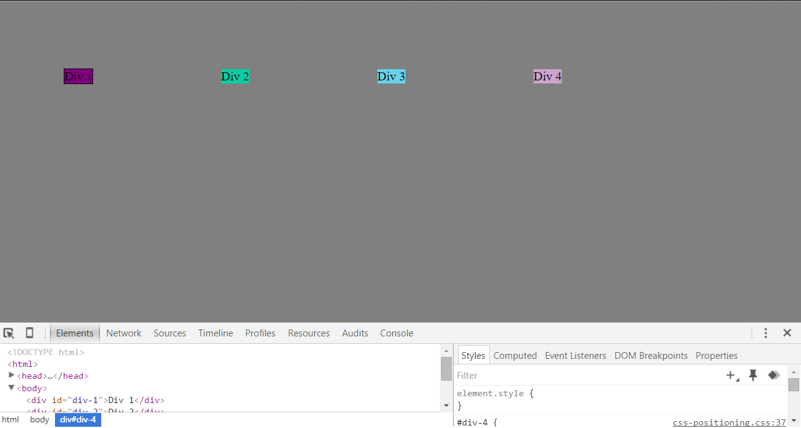
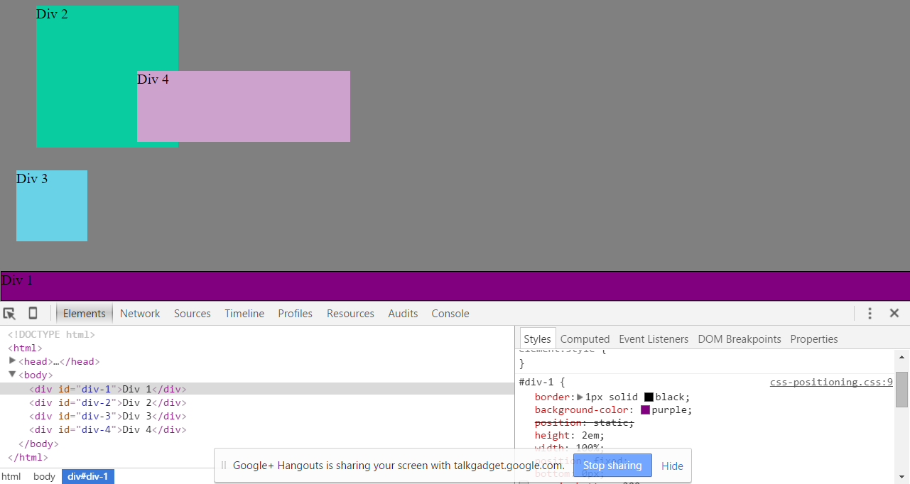

3.4 Chrome DevTools Reflection - Nov 5th 2015

* How can you use Chrome's DevTools inspector to help you format or position elements?

Chrome's DevTools inspector allows you to see exactly how making changes to the CSS affects the position, size, and formattting of elements on the page. Clicking on an element in the HTML brings you right to the relevant CSS. There you can experiement with different changes which are automatically reflected on the page you are working on. This is a very useful tool.

* How can you resize elements on the DOM using CSS?

In this exercise we were working with 
s but I imagine this is the same for most types of elements: you can change the *height* and *width* attributes of your element on the stylesheet to either a number in px (pixels), em(s) (a unit of measurment equal to the browser's default font size) or % (of the height/width of the page). 
* What are the differences between absolute, fixed, static, a
nd relative positioning? Which did you find easiest to use? Which was most difficult?

	- Absolute positioning takes the element out of the flow of other elements and places it based on attributes such as top, left, etc or relative to the nearest positioned anscestor. It will still move when the user scrolls.
	- Fixed position "sticks" the element to the page so that it doesn't move relative to the other elements or to the page itself; ie, scrolling doesn't affect it.
	- Static positioning is the default, it just positions the element within flow of other elements.
	- Relative positioning means that other changes made to positioning will happen *relative* to where the element was without the changes - that is to say, relative to itself 

The easiest (besides static) to use was probably fixed. It was easy to understand the concept of just nailing something to the screen such that it could never be moved. The hardest to understand is probably relative as the concept of "relative to itself" is a little hard to imagine at first, but then when you realize the changes would all be made "relative to where it would have otherwise been" it makes sense.

* What are the differences between margin, border, and padding?

Padding is the space between the content and the border. The border is the edge of the element and "borders" the content. By default the border is invisible (border-style is *none*).Margin is the space between the border and the surroudings (other elements, edge of the page, etc) of an element.

* What was your impression of this challenge overall? (love, hate, and why?)

This challenge took a long time to complete and was at times frustrating, but I think it was very useful in helping me understand CSS positioning and the DOM. 