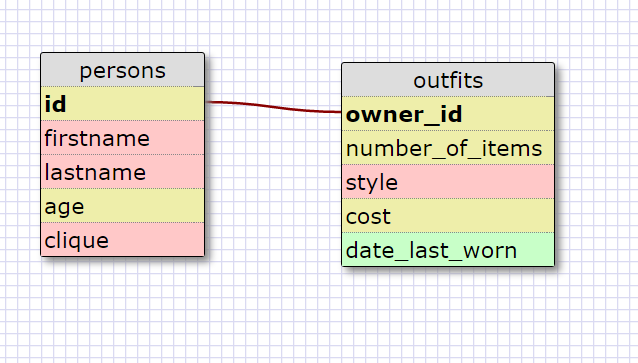

8.4 Introduction to Database Schemas and SQL

1. SELECT * FROM states;

2. SELECT * FROM regions;

3. SELECT state_name,population FROM states;

4. SELECT state_name,population FROM states ORDER BY population DESC;

5. SELECT state_name FROM states WHERE region_id=7;

6.  SELECT state_name,population_density FROM states WHERE population_density>50 ORDER BY population_density ASC;

7. SELECT state_name FROM states WHERE population >= 1000000 AND population <= 1500000;

8. SELECT state_name,region_id FROM states ORDER BY region_id ASC;

9. SELECT region_name FROM regions WHERE region_name LIKE '%Central%';

10. SELECT states.state_name, regions.region_name FROM states INNER JOIN regions ON states.region_id = regions.id ORDER BY states.region_id ASC;

REFLECTION --------
* What are databases for?

Databases are used for storing data in a structured way so that the data can be searched and accessed. Databases store their information in tables of columns (fields) and rows (records).

* What is a one-to-many relationship?

If one record in a table is related to many (any number) of records in another table, it is said to be a one-to-many relationship. For example one person can have many dogs. In the person table we would use a primary key to identify each person. In the dog table we would use the person's primary key as the dog owner's ID, a foreign key.

* What is a primary key? What is a foreign key? How can you determine which is which?

A primary key is unique to each instance (same thing as "record"??) without duplicates, and every instance must have one. A foreign key is an attribute that refers to the primary key of another entity (like the ownerID of a car, as exampled in Dr. Barry Brown's video). A foreign key can be repeated in a table.

* How can you select information out of a SQL database? What are some general guidelines for that?

You use the SELECT and FROM keywords. SELECT (data) FROM (table name). * means "all". You can use the WHERE keyword to filter the data you select.