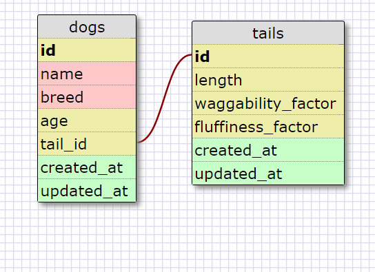

8.5 More Schemas

Release 2

This is a one-to-one relationship because dogs can have at most one tail, and tails belong to only one dog. Because some dogs don't have tails, all the fields in tails, if they were included in dogs, could potentially be empty. So it makes the most sense to move it to another table, and link it one-to-one with the dog table.

Release 4

Reflection: 

* What is a one-to-one database?

A one-to-one database involves two linked tables. For each record in the first table there is at most one record in the second table. 

* When would you use a one-to-one database? (Think generally, not in terms of the example you created).

When there is a lot of information you want to include about a feature of the first table but that feature (ie a tail, a capital city) may not be present. This would leave a lot of blank cells in the first table if we included all the information there.

* What is a many-to-many database?

A many-to-many database involves two tables joined by a third linking table called a join table, which keeps track of the two ids/foreign keys (and possibly other information about the link).

* When would you use a many-to-many database? (Think generally, not in terms of the example you created).

When there are two kinds of entities but they have a relationship with one another in which one of the first kind can be associated with many (ie any number) of the second kind and vice versa.

* What is confusing about database schemas? What makes sense?

I am still confused about how join tables work in many-to-many relationships. But one-to-one relationships/databases make a lot of sense to me.
